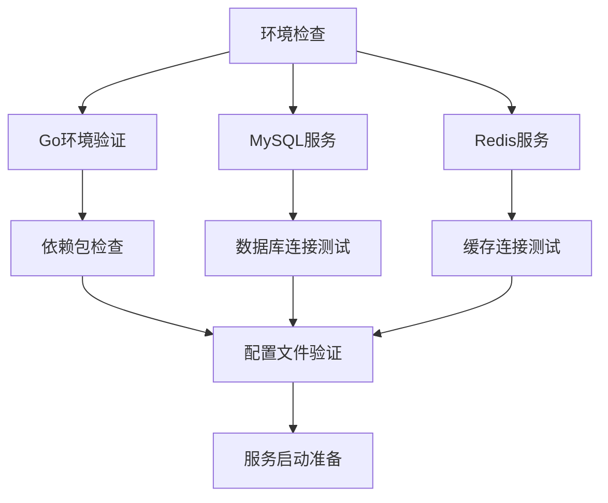
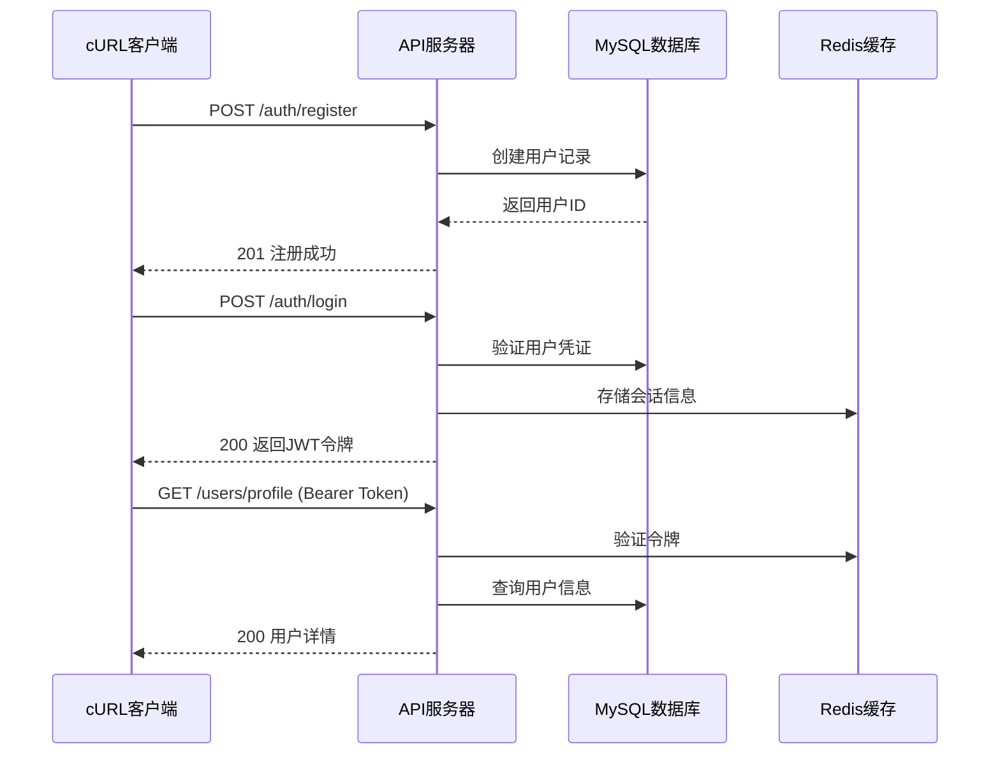
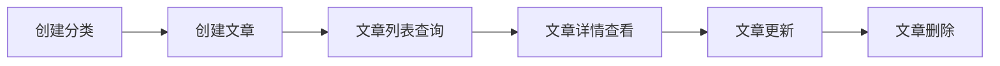
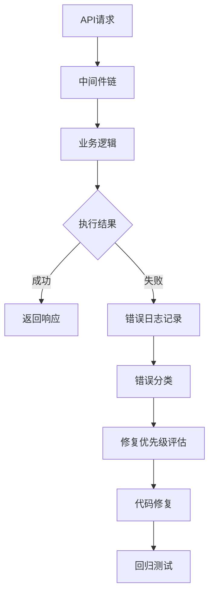
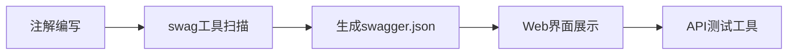
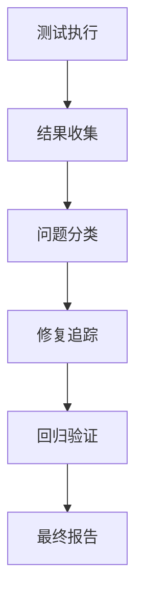

# API 测试与文档化设计方案

## 概述

基于当前 Blog API 项目的开发状态，本文档规划了完整的 API 测试与文档化流程。项目已完成核心功能模块开发，包括用户认证、文章管理、分类管理、评论系统、点赞收藏等功能，现需要进行系统性测试验证和文档完善。

## 技术栈分析

项目采用 Go + Gin + MySQL + Redis + JWT 技术栈：

- **后端框架**: Gin (HTTP 路由和中间件)
- **数据库**: MySQL (主数据存储) + Redis (缓存和会话)
- **认证**: JWT 双令牌机制 (access_token + refresh_token)
- **文档**: Swagger/OpenAPI 3.0 (gin-swagger 集成)
- **日志**: Zap 结构化日志系统

## 测试环境准备

### 环境依赖检查



### 配置文件设置

| 配置项      | 开发环境值     | 说明         |
| ----------- | -------------- | ------------ |
| Server Port | 8080           | API 服务端口 |
| Server Mode | debug          | 开发调试模式 |
| MySQL Host  | localhost:3306 | 数据库连接   |
| Redis Host  | localhost:6379 | 缓存连接     |
| JWT Secret  | dev-secret-key | JWT 签名密钥 |
| Upload Path | ./uploads      | 文件上传目录 |
| Log Level   | debug          | 日志详细程度 |

## API 接口测试矩阵

### 认证模块测试

| 测试用例 | HTTP 方法 | 路径                  | 状态码 | 依赖关系 |
| -------- | --------- | --------------------- | ------ | -------- |
| 用户注册 | POST      | /api/v1/auth/register | 201    | 无       |
| 用户登录 | POST      | /api/v1/auth/login    | 200    | 注册成功 |
| 令牌刷新 | POST      | /api/v1/auth/refresh  | 200    | 登录成功 |
| 用户登出 | POST      | /api/v1/auth/logout   | 200    | 登录成功 |



### 用户管理测试

| 测试用例     | HTTP 方法 | 路径                   | 认证要求     | 预期行为         |
| ------------ | --------- | ---------------------- | ------------ | ---------------- |
| 获取用户资料 | GET       | /api/v1/users/profile  | Bearer Token | 返回当前用户信息 |
| 更新用户资料 | PUT       | /api/v1/users/profile  | Bearer Token | 更新用户基本信息 |
| 修改密码     | PUT       | /api/v1/users/password | Bearer Token | 验证旧密码并更新 |
| 上传头像     | POST      | /api/v1/users/avatar   | Bearer Token | 文件上传处理     |

### 文章管理测试

| 测试用例 | HTTP 方法 | 路径                  | 权限要求    | 测试要点           |
| -------- | --------- | --------------------- | ----------- | ------------------ |
| 创建文章 | POST      | /api/v1/articles      | 已认证用户  | 内容验证、分类关联 |
| 文章列表 | GET       | /api/v1/articles      | 公开访问    | 分页、筛选、排序   |
| 文章详情 | GET       | /api/v1/articles/{id} | 公开访问    | 浏览量统计         |
| 更新文章 | PUT       | /api/v1/articles/{id} | 作者/管理员 | 权限验证           |
| 删除文章 | DELETE    | /api/v1/articles/{id} | 作者/管理员 | 软删除机制         |

### 分类管理测试

| 测试用例 | HTTP 方法 | 路径                    | 权限要求   | 验证内容     |
| -------- | --------- | ----------------------- | ---------- | ------------ |
| 创建分类 | POST      | /api/v1/categories      | 已认证用户 | 名称唯一性   |
| 分类列表 | GET       | /api/v1/categories      | 公开访问   | 文章数量统计 |
| 更新分类 | PUT       | /api/v1/categories/{id} | 创建者     | 所有权验证   |
| 删除分类 | DELETE    | /api/v1/categories/{id} | 创建者     | 关联文章处理 |

### 互动功能测试

| 功能模块 | 测试场景      | API 端点                  | 业务逻辑验证 |
| -------- | ------------- | ------------------------- | ------------ |
| 点赞系统 | 文章点赞/取消 | POST/DELETE /api/v1/likes | 重复点赞检查 |
| 收藏功能 | 收藏夹管理    | CRUD /api/v1/favorites    | 收藏夹权限   |
| 评论系统 | 多级回复      | CRUD /api/v1/comments     | 嵌套关系验证 |

### 文件管理测试

| 测试用例 | 上传类型          | 大小限制 | 格式验证      | 去重机制    |
| -------- | ----------------- | -------- | ------------- | ----------- |
| 图片上传 | JPEG/PNG/GIF/WebP | 10MB     | MIME 类型检查 | SHA256 哈希 |
| 头像更新 | 用户头像          | 2MB      | 尺寸验证      | 旧文件清理  |
| 文章封面 | 封面图片          | 5MB      | 比例检查      | 引用计数    |

## 测试执行流程

### 阶段一：环境验证

```bash
# 检查Go环境
go version

# 验证项目依赖
go mod tidy
go mod verify

# 检查数据库连接
mysql -h localhost -u root -p -e "SELECT VERSION();"

# 验证Redis连接
redis-cli ping
```

### 阶段二：服务启动

```bash
# 复制配置文件
cp configs/config.example.yaml configs/config.yaml

# 更新Swagger文档
swag init -g cmd/server/main.go -o docs

# 启动服务
go run cmd/server/main.go
```

### 阶段三：基础功能测试

**步骤 1: 用户注册**

```bash
curl -X POST http://localhost:8080/api/v1/auth/register \
  -H "Content-Type: application/json" \
  -d '{
    "username": "testuser",
    "email": "test@example.com",
    "password": "password123",
    "nickname": "测试用户"
  }'
```

**步骤 2: 用户登录**

```bash
curl -X POST http://localhost:8080/api/v1/auth/login \
  -H "Content-Type: application/json" \
  -d '{
    "username": "testuser",
    "password": "password123"
  }'
```

**步骤 3: 获取用户资料**

```bash
curl -X GET http://localhost:8080/api/v1/users/profile \
  -H "Authorization: Bearer <access_token>"
```

### 阶段四：核心业务测试

**文章管理流程测试:**



**分类创建测试:**

```bash
curl -X POST http://localhost:8080/api/v1/categories \
  -H "Authorization: Bearer <access_token>" \
  -H "Content-Type: application/json" \
  -d '{
    "name": "技术分享",
    "description": "技术相关文章分类",
    "color": "#409EFF",
    "icon": "tech"
  }'
```

**文章创建测试:**

```bash
curl -X POST http://localhost:8080/api/v1/articles \
  -H "Authorization: Bearer <access_token>" \
  -H "Content-Type: application/json" \
  -d '{
    "title": "Go语言学习心得",
    "content": "这是一篇关于Go语言学习的文章...",
    "description": "Go语言入门指南",
    "category_id": 1,
    "status": "published",
    "visibility": "public",
    "allow_comment": true
  }'
```

### 阶段五：权限验证测试

**管理员功能测试:**

```bash
# 获取用户列表 (管理员权限)
curl -X GET http://localhost:8080/api/v1/admin/users \
  -H "Authorization: Bearer <admin_token>"

# 获取系统统计 (管理员权限)
curl -X GET http://localhost:8080/api/v1/admin/stats \
  -H "Authorization: Bearer <admin_token>"
```

## 错误处理与修复流程

### 常见错误类型

| 错误类型     | HTTP 状态码 | 处理策略       | 修复优先级 |
| ------------ | ----------- | -------------- | ---------- |
| 参数验证错误 | 400         | 参数格式检查   | 高         |
| 认证失败     | 401         | JWT 令牌验证   | 高         |
| 权限不足     | 403         | 权限中间件检查 | 中         |
| 资源不存在   | 404         | 数据查询逻辑   | 中         |
| 服务器错误   | 500         | 异常捕获机制   | 极高       |

### 错误监控机制



### 修复验证流程

**代码修改后的验证步骤:**

1. **单元测试**: 验证修改的函数/方法
2. **集成测试**: 测试相关模块间的交互
3. **回归测试**: 确保修改未破坏现有功能
4. **性能测试**: 评估修改对性能的影响

**Git 提交规范:**

```bash
# 错误修复提交格式
git commit -m "fix(auth): 修复JWT令牌验证逻辑错误

- 修复令牌过期时间计算错误
- 增加令牌格式验证
- 优化错误响应信息

Fixes: #123"
```

## 性能测试与优化

### 性能测试指标

| 测试指标   | 目标值   | 测试工具     | 监控方法     |
| ---------- | -------- | ------------ | ------------ |
| 响应时间   | <200ms   | curl -w      | 请求日志分析 |
| 并发处理   | 100req/s | ab/wrk       | 系统资源监控 |
| 内存使用   | <500MB   | pprof        | Go 性能分析  |
| 数据库连接 | <50%     | MySQL Status | 连接池监控   |

### 缓存效果验证

```bash
# 测试缓存命中率
curl -X GET http://localhost:8080/api/v1/articles/1 \
  -H "Authorization: Bearer <token>" \
  -w "Time: %{time_total}s\n"

# 重复请求验证缓存
curl -X GET http://localhost:8080/api/v1/articles/1 \
  -H "Authorization: Bearer <token>" \
  -w "Time: %{time_total}s\n"
```

## Swagger 文档完善

### 文档生成流程



### 注解规范检查

**控制器注解示例:**

```go
// @Summary 用户注册
// @Description 创建新的用户账户
// @Tags 认证管理
// @Accept json
// @Produce json
// @Param request body RegisterRequest true "注册信息"
// @Success 201 {object} Response{data=User} "注册成功"
// @Failure 400 {object} Response "参数错误"
// @Failure 409 {object} Response "用户已存在"
// @Router /auth/register [post]
```

### 文档质量检查

| 检查项目     | 完成状态 | 检查方法   |
| ------------ | -------- | ---------- |
| API 路径覆盖 | ✅       | 路由对比   |
| 请求参数文档 | ✅       | 结构体注解 |
| 响应格式文档 | ✅       | 响应模型   |
| 错误码说明   | ✅       | 错误定义   |
| 认证方式说明 | ✅       | 安全定义   |

## 测试数据管理

### 测试数据准备

**用户数据:**

```json
{
  "admin_user": {
    "username": "admin",
    "email": "admin@example.com",
    "password": "admin123",
    "role": "admin"
  },
  "normal_user": {
    "username": "testuser",
    "email": "test@example.com",
    "password": "test123",
    "role": "user"
  }
}
```

**文章数据:**

```json
{
  "sample_articles": [
    {
      "title": "Go语言并发编程",
      "content": "详细介绍Go语言的并发特性...",
      "category": "技术分享",
      "status": "published"
    },
    {
      "title": "RESTful API设计原则",
      "content": "REST架构风格的API设计要点...",
      "category": "架构设计",
      "status": "draft"
    }
  ]
}
```

### 数据清理策略

**测试后清理:**

```bash
# 清理测试用户
DELETE FROM users WHERE username LIKE 'test%';

# 清理测试文章
DELETE FROM articles WHERE title LIKE '%测试%';

# 清理测试文件
rm -rf uploads/test_*
```

## 部署前验证

### 生产环境准备检查

| 检查项目   | 验证方法     | 通过标准         |
| ---------- | ------------ | ---------------- |
| 配置文件   | 环境变量检查 | 无敏感信息硬编码 |
| 数据库迁移 | 迁移脚本测试 | 无数据丢失       |
| 静态文件   | 文件路径验证 | 正确的 URL 访问  |
| 日志配置   | 日志轮转测试 | 磁盘空间管理     |
| 安全配置   | 安全头检查   | 符合安全标准     |

### 最终验证清单

- [ ] 所有 API 端点响应正常
- [ ] 认证授权机制工作正确
- [ ] 数据库操作无异常
- [ ] 缓存系统运行稳定
- [ ] 文件上传功能正常
- [ ] 日志记录完整准确
- [ ] Swagger 文档完整可用
- [ ] 性能指标满足要求
- [ ] 错误处理机制完善
- [ ] 安全防护措施到位

## 测试结果文档化

### 测试报告结构



**测试报告模板:**

```markdown
## API 测试报告

### 测试概况

- 测试时间: 2024-XX-XX
- 测试环境: 开发环境
- 测试范围: 全量 API 接口
- 测试工具: cURL + 手动验证

### 测试结果统计

- 总接口数: XX 个
- 测试通过: XX 个
- 测试失败: XX 个
- 成功率: XX%

### 问题清单

| 接口 | 问题描述 | 严重程度 | 修复状态 |
| ---- | -------- | -------- | -------- |
| ...  | ...      | ...      | ...      |

### 修复记录

| 提交 ID | 修复内容 | 影响范围 | 验证结果 |
| ------- | -------- | -------- | -------- |
| ...     | ...      | ...      | ...      |
```
