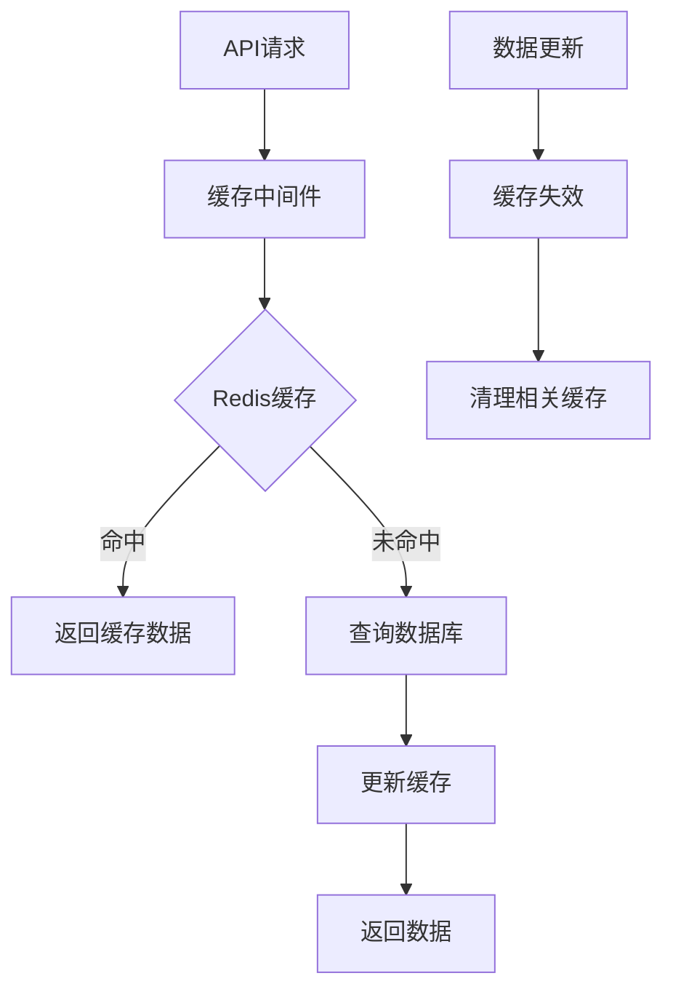
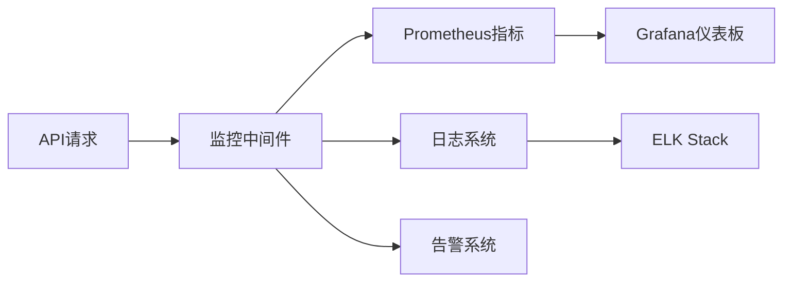
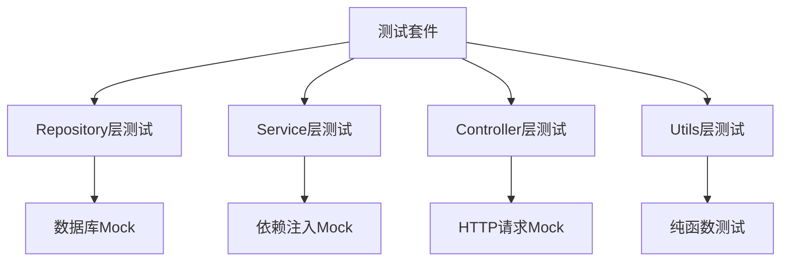
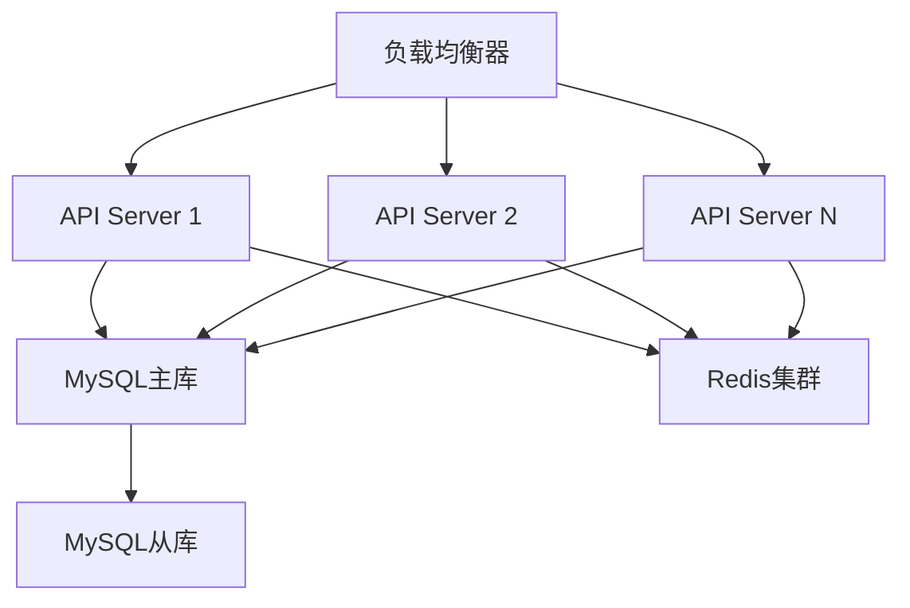

# Blog API 剩余任务完成方案设计

## 概述

基于 TODO.md 文件分析，博客 API 项目已完成大部分核心功能模块，包括用户认证、文章管理、分类管理、互动功能等。当前需要完成的剩余任务主要集中在性能优化、测试和部署方面。

## 当前完成状态

### ✅ 已完成模块

- 用户认证和管理系统
- 文章 CRUD 及搜索功能
- 分类管理系统
- 文件上传和管理
- 互动功能（点赞、收藏、评论）
- 基础安全防护（限流、参数验证、CORS）
- 系统管理和统计功能
- 核心中间件系统

### 🔄 部分完成

- 性能优化：数据库优化 ✅、日志系统 ✅
- 安全防护：缺少安全头中间件

### ⏳ 待完成任务

1. Redis 缓存策略实现
2. API 监控指标系统
3. 安全头中间件
4. 单元测试框架
5. 集成测试
6. 部署脚本和运维文档

## 剩余任务详细设计

### 1. Redis 缓存策略实现

#### 1.1 缓存架构设计



#### 1.2 缓存策略分层

**热点数据缓存**

- 用户信息：`user:{user_id}` TTL: 1 小时
- 文章详情：`article:{article_id}` TTL: 30 分钟
- 分类列表：`categories:all` TTL: 24 小时
- 热门文章：`articles:hot` TTL: 6 小时

**统计数据缓存**

- 文章点赞数：`article:likes:{article_id}` TTL: 5 分钟
- 文章浏览量：`article:views:{article_id}` TTL: 10 分钟
- 用户统计：`user:stats:{user_id}` TTL: 1 小时

#### 1.3 缓存键设计规范

```go
// 缓存键常量定义
const (
    // 用户相关
    UserInfoKey     = "user:%d"           // 用户信息
    UserStatsKey    = "user:stats:%d"     // 用户统计

    // 文章相关
    ArticleKey      = "article:%d"        // 文章详情
    ArticleListKey  = "articles:list:%s"  // 文章列表（按条件）
    HotArticlesKey  = "articles:hot"      // 热门文章

    // 分类相关
    CategoryListKey = "categories:all"    // 所有分类
    CategoryKey     = "category:%d"       // 分类详情

    // 统计相关
    ArticleLikesKey = "article:likes:%d"  // 文章点赞数
    ArticleViewsKey = "article:views:%d"  // 文章浏览量
)
```

#### 1.4 缓存更新策略

**写入策略**

- Cache-Aside 模式：业务代码控制缓存更新
- 数据更新时先更新数据库，再删除相关缓存
- 使用 Redis 管道批量操作减少网络开销

**失效策略**

- 基于 TTL 的自动过期
- 手动清理关联缓存
- 使用 Redis 的发布订阅通知缓存更新

### 2. API 监控指标系统

#### 2.1 监控架构



#### 2.2 核心监控指标

**性能指标**

- API 响应时间分布
- QPS（每秒请求数）
- 错误率统计
- 数据库连接池使用率
- Redis 连接池使用率

**业务指标**

- 用户注册数
- 文章发布数
- 活跃用户数
- 热门接口访问排行

#### 2.3 监控中间件设计

```go
// 监控指标结构
type Metrics struct {
    RequestDuration   *prometheus.HistogramVec
    RequestTotal      *prometheus.CounterVec
    ActiveConnections prometheus.Gauge
    ErrorTotal        *prometheus.CounterVec
}

// 中间件实现
func MetricsMiddleware(metrics *Metrics) gin.HandlerFunc {
    return func(c *gin.Context) {
        start := time.Now()
        path := c.Request.URL.Path
        method := c.Request.Method

        c.Next()

        duration := time.Since(start).Seconds()
        status := strconv.Itoa(c.Writer.Status())

        // 记录请求指标
        metrics.RequestDuration.WithLabelValues(method, path, status).Observe(duration)
        metrics.RequestTotal.WithLabelValues(method, path, status).Inc()

        // 记录错误指标
        if c.Writer.Status() >= 400 {
            metrics.ErrorTotal.WithLabelValues(method, path, status).Inc()
        }
    }
}
```

### 3. 安全头中间件

#### 3.1 安全防护策略

**XSS 防护**

- Content-Security-Policy 头设置
- X-XSS-Protection 启用
- X-Content-Type-Options 防止 MIME 嗅探

**其他安全头**

- X-Frame-Options 防止点击劫持
- Strict-Transport-Security 强制 HTTPS
- Referrer-Policy 控制引用信息

#### 3.2 安全中间件实现

```go
func SecurityMiddleware() gin.HandlerFunc {
    return func(c *gin.Context) {
        // XSS防护
        c.Header("X-XSS-Protection", "1; mode=block")
        c.Header("X-Content-Type-Options", "nosniff")
        c.Header("X-Frame-Options", "DENY")

        // CSP策略
        csp := "default-src 'self'; script-src 'self' 'unsafe-inline'; style-src 'self' 'unsafe-inline'"
        c.Header("Content-Security-Policy", csp)

        // HSTS（生产环境）
        if gin.Mode() == gin.ReleaseMode {
            c.Header("Strict-Transport-Security", "max-age=31536000; includeSubDomains")
        }

        c.Next()
    }
}
```

### 4. 单元测试框架

#### 4.1 测试架构设计



#### 4.2 测试分层策略

**Repository 层测试**

- 使用 SQLite 内存数据库或 MockDB
- 测试 CRUD 操作的正确性
- 验证 SQL 查询逻辑

**Service 层测试**

- Mock Repository 依赖
- 测试业务逻辑正确性
- 验证错误处理机制

**Controller 层测试**

- Mock Service 依赖
- 测试 HTTP 请求处理
- 验证参数验证逻辑

#### 4.3 测试工具选择

**核心测试库**

- testify：断言和 Mock 框架
- go-sqlmock：数据库 Mock
- httptest：HTTP 测试

**测试辅助工具**

- GoConvey：BDD 风格测试
- Ginkgo：行为驱动测试框架

### 5. 集成测试

#### 5.1 测试环境搭建

**Docker Compose 测试环境**

```yaml
version: "3.8"
services:
  test-mysql:
    image: mysql:8.0
    environment:
      MYSQL_ROOT_PASSWORD: test123
      MYSQL_DATABASE: blog_test
    ports:
      - "3307:3306"

  test-redis:
    image: redis:6.0
    ports:
      - "6380:6379"

  blog-api:
    build: .
    depends_on:
      - test-mysql
      - test-redis
    environment:
      - ENV=test
```

#### 5.2 API 集成测试

**测试场景覆盖**

- 用户注册登录流程
- 文章 CRUD 操作流程
- 文件上传流程
- 权限验证流程

**测试数据管理**

- 测试前数据初始化
- 测试后数据清理
- 测试数据隔离

### 6. 部署脚本和运维文档

#### 6.1 部署架构



#### 6.2 Docker 部署方案

**多阶段构建 Dockerfile**

```dockerfile
# 构建阶段
FROM golang:1.19-alpine AS builder
WORKDIR /app
COPY go.mod go.sum ./
RUN go mod download
COPY . .
RUN CGO_ENABLED=0 GOOS=linux go build -o blog-api cmd/server/main.go

# 运行阶段
FROM alpine:latest
RUN apk --no-cache add ca-certificates tzdata
WORKDIR /root/
COPY --from=builder /app/blog-api .
COPY --from=builder /app/configs ./configs
EXPOSE 8080
CMD ["./blog-api"]
```

#### 6.3 Kubernetes 部署配置

**Deployment 配置**

```yaml
apiVersion: apps/v1
kind: Deployment
metadata:
  name: blog-api
spec:
  replicas: 3
  selector:
    matchLabels:
      app: blog-api
  template:
    metadata:
      labels:
        app: blog-api
    spec:
      containers:
        - name: blog-api
          image: blog-api:latest
          ports:
            - containerPort: 8080
          env:
            - name: ENV
              value: "production"
          resources:
            requests:
              memory: "256Mi"
              cpu: "250m"
            limits:
              memory: "512Mi"
              cpu: "500m"
```

#### 6.4 CI/CD 流水线

**GitHub Actions 配置**

```yaml
name: CI/CD Pipeline
on:
  push:
    branches: [main]
  pull_request:
    branches: [main]

jobs:
  test:
    runs-on: ubuntu-latest
    steps:
      - uses: actions/checkout@v3
      - uses: actions/setup-go@v3
        with:
          go-version: 1.19
      - name: Run tests
        run: go test ./...

  build:
    needs: test
    runs-on: ubuntu-latest
    steps:
      - uses: actions/checkout@v3
      - name: Build Docker image
        run: docker build -t blog-api .
      - name: Deploy to production
        if: github.ref == 'refs/heads/main'
        run: ./scripts/deploy.sh
```

## 实施优先级

### 高优先级（立即实施）

1. **Redis 缓存策略** - 提升系统性能
2. **安全头中间件** - 完善安全防护
3. **基础监控指标** - 系统可观测性

### 中优先级（近期实施）

4. **单元测试框架** - 代码质量保障
5. **基础部署脚本** - 部署自动化

### 低优先级（后期完善）

6. **完整集成测试** - 全流程测试
7. **高级监控告警** - 运维能力提升
8. **K8s 部署方案** - 生产环境扩展

## 技术约束

### 依赖要求

- Go 1.19+
- MySQL 8.0+
- Redis 6.0+
- Docker 20.10+

### 性能目标

- API 响应时间 < 200ms (P95)
- 并发支持 > 1000 QPS
- 缓存命中率 > 80%
- 错误率 < 0.1%

### 安全要求

- 所有 API 强制 HTTPS
- 敏感接口限流保护
- XSS/CSRF 防护
- SQL 注入防护

## 验收标准

### 功能验收

- [ ] Redis 缓存正常工作，命中率达标
- [ ] 监控指标正确收集和展示
- [ ] 安全头正确设置
- [ ] 单元测试覆盖率 > 80%
- [ ] 集成测试通过率 100%
- [ ] 部署脚本正常执行

### 性能验收

- [ ] 接口响应时间符合要求
- [ ] 并发性能达到目标
- [ ] 资源使用率合理
- [ ] 缓存性能提升明显

### 安全验收

- [ ] 安全扫描无高危漏洞
- [ ] 渗透测试通过
- [ ] 安全配置正确
- [ ] 监控告警正常
