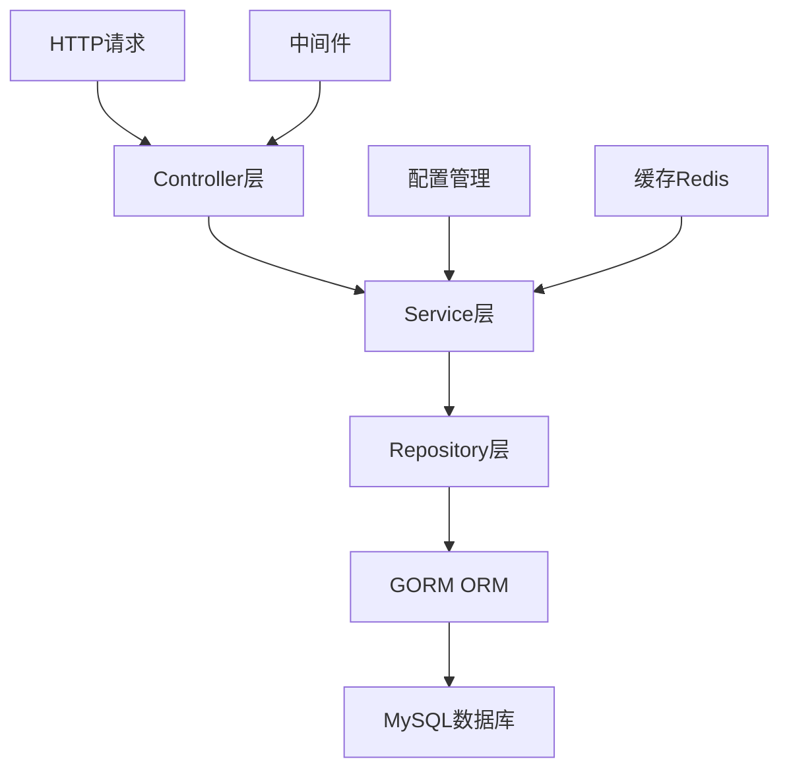
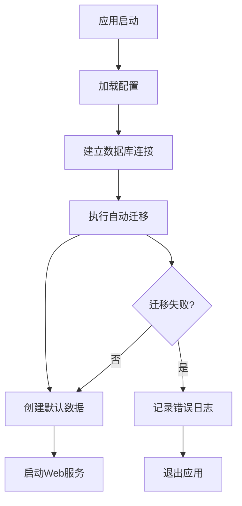
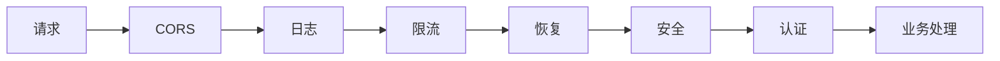

# Blog API 项目设置与 GORM 数据库管理设计

## 1. 概述

本文档设计了博客 API 项目的标准化设置流程，包含开发规范制定、GORM 数据库管理集成、项目结构优化等核心内容。采用自动化数据库迁移替代手动 SQL 脚本，提升开发效率和数据库管理的一致性。

## 2. 技术栈与架构

### 2.1 核心技术栈

- **编程语言**: Go 1.24.5
- **Web 框架**: Gin
- **ORM 框架**: GORM v1.30.1
- **数据库**: MySQL 8.0+
- **缓存**: Redis 6.0+
- **认证**: JWT Token
- **配置管理**: YAML
- **依赖管理**: Go Modules

### 2.2 架构模式

采用经典三层架构：

- **Controller 层**: HTTP 请求处理和响应
- **Service 层**: 业务逻辑处理
- **Repository 层**: 数据访问抽象
- **Model 层**: 数据模型定义



## 3. 项目目录结构设计

### 3.1 标准目录结构

```
blog-api/
├── cmd/                    # 应用程序入口
│   └── server/
│       └── main.go        # 主程序入口
├── internal/              # 内部代码，不对外暴露
│   ├── controllers/       # HTTP控制器
│   ├── services/         # 业务逻辑层
│   ├── repositories/     # 数据访问层
│   ├── models/          # 数据模型
│   ├── middlewares/     # 中间件
│   ├── routes/          # 路由定义
│   ├── utils/           # 工具函数
│   └── types/           # 类型定义
├── pkg/                 # 公共代码库
│   ├── config/         # 配置管理
│   ├── database/       # 数据库连接
│   ├── response/       # 统一响应格式
│   └── errors/         # 错误定义
├── configs/            # 配置文件
├── migrations/         # 数据库迁移文件
├── uploads/           # 文件上传目录
├── logs/              # 日志文件
└── scripts/           # 脚本文件
```

### 3.2 包命名规范

- **控制器**: `xxxController` (如: `AuthController`, `ArticleController`)
- **服务**: `xxxService` (如: `AuthService`, `ArticleService`)
- **仓库**: `xxxRepository` (如: `UserRepository`, `ArticleRepository`)
- **模型**: 使用单数形式 (如: `User`, `Article`)

## 4. GORM 数据库管理设计

### 4.1 GORM 配置与连接

#### 4.1.1 数据库连接配置

```go
type DatabaseConfig struct {
    Host     string `yaml:"host"`
    Port     int    `yaml:"port"`
    Username string `yaml:"username"`
    Password string `yaml:"password"`
    DBName   string `yaml:"dbname"`
    Charset  string `yaml:"charset"`
}
```

#### 4.1.2 连接池配置

- **最大空闲连接**: 10
- **最大打开连接**: 100
- **连接最大生存时间**: 1 小时
- **连接最大空闲时间**: 30 分钟

### 4.2 GORM 模型设计规范

#### 4.2.1 基础模型结构

```go
type BaseModel struct {
    ID        uint      `gorm:"primarykey" json:"id"`
    CreatedAt time.Time `json:"created_at"`
    UpdatedAt time.Time `json:"updated_at"`
}
```

#### 4.2.2 软删除支持

```go
type SoftDeleteModel struct {
    BaseModel
    DeletedAt gorm.DeletedAt `gorm:"index" json:"-"`
}
```

### 4.3 数据模型定义

#### 4.3.1 用户模型 (User)

```go
type User struct {
    BaseModel
    Username      string `gorm:"uniqueIndex;size:50;not null" json:"username"`
    Email         string `gorm:"uniqueIndex;size:100;not null" json:"email"`
    Password      string `gorm:"size:255;not null" json:"-"`
    Nickname      string `gorm:"size:50" json:"nickname"`
    Avatar        string `gorm:"size:255" json:"avatar"`
    Bio           string `gorm:"type:text" json:"bio"`
    Role          string `gorm:"type:enum('admin','user');default:'user'" json:"role"`
    Status        string `gorm:"type:enum('active','inactive');default:'active'" json:"status"`
    EmailVerified bool   `gorm:"default:false" json:"email_verified"`
}
```

#### 4.3.2 文章模型 (Article)

```go
type Article struct {
    BaseModel
    UserID        uint   `gorm:"not null;index" json:"user_id"`
    Title         string `gorm:"size:255;not null" json:"title"`
    Content       string `gorm:"type:longtext" json:"content"`
    Description   string `gorm:"type:text" json:"description"`
    CoverImage    string `gorm:"size:255" json:"cover_image"`
    CategoryID    *uint  `gorm:"index" json:"category_id"`
    Status        string `gorm:"type:enum('draft','published');default:'draft'" json:"status"`
    Visibility    string `gorm:"type:enum('public','private');default:'public'" json:"visibility"`
    ViewCount     int    `gorm:"default:0" json:"view_count"`
    LikeCount     int    `gorm:"default:0" json:"like_count"`
    FavoriteCount int    `gorm:"default:0" json:"favorite_count"`

    // 关联关系
    User     User      `gorm:"foreignKey:UserID" json:"user"`
    Category *Category `gorm:"foreignKey:CategoryID" json:"category"`
}
```

### 4.4 自动迁移机制

#### 4.4.1 迁移管理器

```go
type MigrationManager struct {
    db *gorm.DB
}

func (m *MigrationManager) AutoMigrate() error {
    return m.db.AutoMigrate(
        &User{},
        &Article{},
        &Category{},
        &Comment{},
        &ArticleLike{},
        &ArticleFavorite{},
        &FavoriteFolder{},
        &CommentLike{},
        &File{},
    )
}
```

#### 4.4.2 数据库初始化流程



## 5. Repository 模式设计

### 5.1 Repository 接口定义

```go
type UserRepository interface {
    Create(user *User) error
    GetByID(id uint) (*User, error)
    GetByEmail(email string) (*User, error)
    GetByUsername(username string) (*User, error)
    Update(user *User) error
    Delete(id uint) error
    List(offset, limit int) ([]*User, error)
}
```

### 5.2 Repository 实现

```go
type userRepository struct {
    db *gorm.DB
}

func (r *userRepository) Create(user *User) error {
    return r.db.Create(user).Error
}

func (r *userRepository) GetByID(id uint) (*User, error) {
    var user User
    err := r.db.First(&user, id).Error
    if err != nil {
        return nil, err
    }
    return &user, nil
}
```

## 6. 错误处理与验证

### 6.1 统一错误定义

```go
type APIError struct {
    Code    int    `json:"code"`
    Message string `json:"message"`
    Details string `json:"details,omitempty"`
}

var (
    ErrUserNotFound     = &APIError{Code: 404, Message: "用户不存在"}
    ErrInvalidPassword  = &APIError{Code: 401, Message: "密码错误"}
    ErrEmailExists      = &APIError{Code: 400, Message: "邮箱已存在"}
)
```

### 6.2 数据验证规范

- 使用 `validator/v10` 进行结构体验证
- 自定义验证规则
- 国际化错误消息

## 7. 配置管理设计

### 7.1 配置文件结构

```yaml
server:
  port: 8080
  mode: debug

database:
  host: localhost
  port: 3306
  username: root
  password: password
  dbname: blog_api
  charset: utf8mb4

redis:
  host: localhost
  port: 6379
  password: ""
  db: 0

jwt:
  secret: your-secret-key
  access_expire: 3600 # 1小时
  refresh_expire: 604800 # 7天

upload:
  path: ./uploads
  max_size: 10485760 # 10MB
  allowed_types:
    - image/jpeg
    - image/png
    - image/gif
```

### 7.2 环境配置

- **开发环境**: `config.yaml`
- **测试环境**: `config.test.yaml`
- **生产环境**: `config.prod.yaml`

## 8. 中间件设计

### 8.1 核心中间件列表

- **CORS 中间件**: 跨域请求处理
- **日志中间件**: 请求日志记录
- **限流中间件**: API 访问频率限制
- **认证中间件**: JWT Token 验证
- **恢复中间件**: Panic 错误恢复
- **安全中间件**: 安全头设置

### 8.2 中间件执行顺序



## 9. 开发规范

### 9.1 代码规范

- **命名规范**:
  - 变量: camelCase
  - 常量: UPPER_SNAKE_CASE
  - 函数: PascalCase (公开), camelCase (私有)
  - 包名: 小写单词
- **注释规范**:
  - 公开函数必须有注释
  - 复杂逻辑需要详细注释
  - TODO 标记待完成功能
- **错误处理**:
  - 不忽略任何错误
  - 使用自定义错误类型
  - 错误信息要明确具体

### 9.2 Git 提交规范

- **提交消息格式**: `type(scope): description`
- **类型定义**:
  - `feat`: 新功能
  - `fix`: 错误修复
  - `docs`: 文档更新
  - `style`: 代码格式化
  - `refactor`: 代码重构
  - `test`: 测试相关
  - `chore`: 构建过程或辅助工具变动

## 10. 测试策略

### 10.1 测试层级

```mermaid
pyramid
    title 测试金字塔
    "单元测试" : 70
    "集成测试" : 20
    "端到端测试" : 10
```

### 10.2 测试覆盖率目标

- **单元测试**: 覆盖率 >= 80%
- **集成测试**: 核心 API 接口 100%覆盖
- **性能测试**: 响应时间 < 500ms

## 11. 部署与运维

### 11.1 Docker 容器化

```dockerfile
FROM golang:1.24-alpine AS builder
WORKDIR /app
COPY . .
RUN go build -o blog-api cmd/server/main.go

FROM alpine:latest
RUN apk --no-cache add ca-certificates tzdata
WORKDIR /root/
COPY --from=builder /app/blog-api .
COPY --from=builder /app/configs ./configs
EXPOSE 8080
CMD ["./blog-api"]
```

### 11.2 数据库备份策略

- **自动备份**: 每天凌晨 2 点
- **备份保留**: 30 天
- **备份验证**: 定期恢复测试

## 12. 性能优化

### 12.1 数据库优化

- **索引优化**: 为常用查询字段添加索引
- **查询优化**: 避免 N+1 问题，使用预加载
- **连接池**: 合理配置连接池参数

### 12.2 缓存策略

- **Redis 缓存**: 热点数据缓存
- **应用缓存**: 内存缓存静态数据
- **HTTP 缓存**: 设置合理的缓存头

## 13. 监控与日志

### 13.1 日志级别

- **DEBUG**: 调试信息
- **INFO**: 一般信息
- **WARN**: 警告信息
- **ERROR**: 错误信息

### 13.2 监控指标

- **应用指标**: QPS、响应时间、错误率
- **系统指标**: CPU、内存、磁盘使用率
- **数据库指标**: 连接数、慢查询、锁等待

## 14. 实施计划

### 14.1 第一阶段: 基础设施搭建

1. **完善项目结构**: 创建标准目录和基础文件
2. **GORM 集成**: 数据库连接和模型定义
3. **自动迁移**: 实现数据库自动迁移功能
4. **配置管理**: 完善配置文件和环境管理
5. **基础中间件**: 实现核心中间件

### 14.2 第二阶段: 核心功能开发

1. **用户认证**: 注册、登录、JWT 实现
2. **文章管理**: 文章 CRUD 基本功能
3. **分类管理**: 分类系统实现
4. **API 文档**: Swagger 文档集成

### 14.3 第三阶段: 功能完善

1. **互动功能**: 点赞、收藏、评论系统
2. **文件上传**: 图片上传和管理
3. **权限管理**: 角色权限和访问控制
4. **性能优化**: 缓存和查询优化
   本文档设计了博客 API 项目的标准化设置流程，包含开发规范制定、GORM 数据库管理集成、项目结构优化等核心内容。采用自动化数据库迁移替代手动 SQL 脚本，提升开发效率和数据库管理的一致性。

## 2. 技术栈与架构

### 2.1 核心技术栈

- **编程语言**: Go 1.24.5
- **Web 框架**: Gin
- **ORM 框架**: GORM v1.30.1
- **数据库**: MySQL 8.0+
- **缓存**: Redis 6.0+
- **认证**: JWT Token
- **配置管理**: YAML
- **依赖管理**: Go Modules

### 2.2 架构模式

采用经典三层架构：

- **Controller 层**: HTTP 请求处理和响应
- **Service 层**: 业务逻辑处理
- **Repository 层**: 数据访问抽象
- **Model 层**: 数据模型定义


## 3. 项目目录结构设计

### 3.1 标准目录结构

```
blog-api/
├── cmd/                    # 应用程序入口
│   └── server/
│       └── main.go        # 主程序入口
├── internal/              # 内部代码，不对外暴露
│   ├── controllers/       # HTTP控制器
│   ├── services/         # 业务逻辑层
│   ├── repositories/     # 数据访问层
│   ├── models/          # 数据模型
│   ├── middlewares/     # 中间件
│   ├── routes/          # 路由定义
│   ├── utils/           # 工具函数
│   └── types/           # 类型定义
├── pkg/                 # 公共代码库
│   ├── config/         # 配置管理
│   ├── database/       # 数据库连接
│   ├── response/       # 统一响应格式
│   └── errors/         # 错误定义
├── configs/            # 配置文件
├── migrations/         # 数据库迁移文件
├── uploads/           # 文件上传目录
├── logs/              # 日志文件
└── scripts/           # 脚本文件
```

### 3.2 包命名规范

- **控制器**: `xxxController` (如: `AuthController`, `ArticleController`)
- **服务**: `xxxService` (如: `AuthService`, `ArticleService`)
- **仓库**: `xxxRepository` (如: `UserRepository`, `ArticleRepository`)
- **模型**: 使用单数形式 (如: `User`, `Article`)

## 4. GORM 数据库管理设计

### 4.1 GORM 配置与连接

#### 4.1.1 数据库连接配置

```go
type DatabaseConfig struct {
    Host     string `yaml:"host"`
    Port     int    `yaml:"port"`
    Username string `yaml:"username"`
    Password string `yaml:"password"`
    DBName   string `yaml:"dbname"`
    Charset  string `yaml:"charset"`
}
```

#### 4.1.2 连接池配置

- **最大空闲连接**: 10
- **最大打开连接**: 100
- **连接最大生存时间**: 1 小时
- **连接最大空闲时间**: 30 分钟

### 4.2 GORM 模型设计规范

#### 4.2.1 基础模型结构

```go
type BaseModel struct {
    ID        uint      `gorm:"primarykey" json:"id"`
    CreatedAt time.Time `json:"created_at"`
    UpdatedAt time.Time `json:"updated_at"`
}
```

#### 4.2.2 软删除支持

```go
type SoftDeleteModel struct {
    BaseModel
    DeletedAt gorm.DeletedAt `gorm:"index" json:"-"`
}
```

### 4.3 数据模型定义

#### 4.3.1 用户模型 (User)

```go
type User struct {
    BaseModel
    Username      string `gorm:"uniqueIndex;size:50;not null" json:"username"`
    Email         string `gorm:"uniqueIndex;size:100;not null" json:"email"`
    Password      string `gorm:"size:255;not null" json:"-"`
    Nickname      string `gorm:"size:50" json:"nickname"`
    Avatar        string `gorm:"size:255" json:"avatar"`
    Bio           string `gorm:"type:text" json:"bio"`
    Role          string `gorm:"type:enum('admin','user');default:'user'" json:"role"`
    Status        string `gorm:"type:enum('active','inactive');default:'active'" json:"status"`
    EmailVerified bool   `gorm:"default:false" json:"email_verified"`
}
```

#### 4.3.2 文章模型 (Article)

```go
type Article struct {
    BaseModel
    UserID        uint   `gorm:"not null;index" json:"user_id"`
    Title         string `gorm:"size:255;not null" json:"title"`
    Content       string `gorm:"type:longtext" json:"content"`
    Description   string `gorm:"type:text" json:"description"`
    CoverImage    string `gorm:"size:255" json:"cover_image"`
    CategoryID    *uint  `gorm:"index" json:"category_id"`
    Status        string `gorm:"type:enum('draft','published');default:'draft'" json:"status"`
    Visibility    string `gorm:"type:enum('public','private');default:'public'" json:"visibility"`
    ViewCount     int    `gorm:"default:0" json:"view_count"`
    LikeCount     int    `gorm:"default:0" json:"like_count"`
    FavoriteCount int    `gorm:"default:0" json:"favorite_count"`

    // 关联关系
    User     User      `gorm:"foreignKey:UserID" json:"user"`
    Category *Category `gorm:"foreignKey:CategoryID" json:"category"`
}
```

### 4.4 自动迁移机制

#### 4.4.1 迁移管理器

```go
type MigrationManager struct {
    db *gorm.DB
}

func (m *MigrationManager) AutoMigrate() error {
    return m.db.AutoMigrate(
        &User{},
        &Article{},
        &Category{},
        &Comment{},
        &ArticleLike{},
        &ArticleFavorite{},
        &FavoriteFolder{},
        &CommentLike{},
        &File{},
    )
}
```

#### 4.4.2 数据库初始化流程


## 5. Repository 模式设计

### 5.1 Repository 接口定义

```go
type UserRepository interface {
    Create(user *User) error
    GetByID(id uint) (*User, error)
    GetByEmail(email string) (*User, error)
    GetByUsername(username string) (*User, error)
    Update(user *User) error
    Delete(id uint) error
    List(offset, limit int) ([]*User, error)
}
```

### 5.2 Repository 实现

```go
type userRepository struct {
    db *gorm.DB
}

func (r *userRepository) Create(user *User) error {
    return r.db.Create(user).Error
}

func (r *userRepository) GetByID(id uint) (*User, error) {
    var user User
    err := r.db.First(&user, id).Error
    if err != nil {
        return nil, err
    }
    return &user, nil
}
```

## 6. 错误处理与验证

### 6.1 统一错误定义

```go
type APIError struct {
    Code    int    `json:"code"`
    Message string `json:"message"`
    Details string `json:"details,omitempty"`
}

var (
    ErrUserNotFound     = &APIError{Code: 404, Message: "用户不存在"}
    ErrInvalidPassword  = &APIError{Code: 401, Message: "密码错误"}
    ErrEmailExists      = &APIError{Code: 400, Message: "邮箱已存在"}
)
```

### 6.2 数据验证规范

- 使用 `validator/v10` 进行结构体验证
- 自定义验证规则
- 国际化错误消息

## 7. 配置管理设计

### 7.1 配置文件结构

```yaml
server:
  port: 8080
  mode: debug

database:
  host: localhost
  port: 3306
  username: root
  password: password
  dbname: blog_api
  charset: utf8mb4

redis:
  host: localhost
  port: 6379
  password: ""
  db: 0

jwt:
  secret: your-secret-key
  access_expire: 3600 # 1小时
  refresh_expire: 604800 # 7天

upload:
  path: ./uploads
  max_size: 10485760 # 10MB
  allowed_types:
    - image/jpeg
    - image/png
    - image/gif
```

### 7.2 环境配置

- **开发环境**: `config.yaml`
- **测试环境**: `config.test.yaml`
- **生产环境**: `config.prod.yaml`

## 8. 中间件设计

### 8.1 核心中间件列表

- **CORS 中间件**: 跨域请求处理
- **日志中间件**: 请求日志记录
- **限流中间件**: API 访问频率限制
- **认证中间件**: JWT Token 验证
- **恢复中间件**: Panic 错误恢复
- **安全中间件**: 安全头设置

### 8.2 中间件执行顺序


## 9. 开发规范

### 9.1 代码规范

- **命名规范**:
  - 变量: camelCase
  - 常量: UPPER_SNAKE_CASE
  - 函数: PascalCase (公开), camelCase (私有)
  - 包名: 小写单词
- **注释规范**:
  - 公开函数必须有注释
  - 复杂逻辑需要详细注释
  - TODO 标记待完成功能
- **错误处理**:
  - 不忽略任何错误
  - 使用自定义错误类型
  - 错误信息要明确具体

### 9.2 Git 提交规范

- **提交消息格式**: `type(scope): description`
- **类型定义**:
  - `feat`: 新功能
  - `fix`: 错误修复
  - `docs`: 文档更新
  - `style`: 代码格式化
  - `refactor`: 代码重构
  - `test`: 测试相关
  - `chore`: 构建过程或辅助工具变动

## 10. 测试策略

### 10.1 测试层级

```mermaid
pyramid
    title 测试金字塔
    "单元测试" : 70
    "集成测试" : 20
    "端到端测试" : 10
```

### 10.2 测试覆盖率目标

- **单元测试**: 覆盖率 >= 80%
- **集成测试**: 核心 API 接口 100%覆盖
- **性能测试**: 响应时间 < 500ms

## 11. 部署与运维

### 11.1 Docker 容器化

```dockerfile
FROM golang:1.24-alpine AS builder
WORKDIR /app
COPY . .
RUN go build -o blog-api cmd/server/main.go

FROM alpine:latest
RUN apk --no-cache add ca-certificates tzdata
WORKDIR /root/
COPY --from=builder /app/blog-api .
COPY --from=builder /app/configs ./configs
EXPOSE 8080
CMD ["./blog-api"]
```

### 11.2 数据库备份策略

- **自动备份**: 每天凌晨 2 点
- **备份保留**: 30 天
- **备份验证**: 定期恢复测试

## 12. 性能优化

### 12.1 数据库优化

- **索引优化**: 为常用查询字段添加索引
- **查询优化**: 避免 N+1 问题，使用预加载
- **连接池**: 合理配置连接池参数

### 12.2 缓存策略

- **Redis 缓存**: 热点数据缓存
- **应用缓存**: 内存缓存静态数据
- **HTTP 缓存**: 设置合理的缓存头

## 13. 监控与日志

### 13.1 日志级别

- **DEBUG**: 调试信息
- **INFO**: 一般信息
- **WARN**: 警告信息
- **ERROR**: 错误信息

### 13.2 监控指标

- **应用指标**: QPS、响应时间、错误率
- **系统指标**: CPU、内存、磁盘使用率
- **数据库指标**: 连接数、慢查询、锁等待

## 14. 实施计划

### 14.1 第一阶段: 基础设施搭建

1. **完善项目结构**: 创建标准目录和基础文件
2. **GORM 集成**: 数据库连接和模型定义
3. **自动迁移**: 实现数据库自动迁移功能
4. **配置管理**: 完善配置文件和环境管理
5. **基础中间件**: 实现核心中间件

### 14.2 第二阶段: 核心功能开发

1. **用户认证**: 注册、登录、JWT 实现
2. **文章管理**: 文章 CRUD 基本功能
3. **分类管理**: 分类系统实现
4. **API 文档**: Swagger 文档集成

### 14.3 第三阶段: 功能完善

1. **互动功能**: 点赞、收藏、评论系统
2. **文件上传**: 图片上传和管理
3. **权限管理**: 角色权限和访问控制
4. **性能优化**: 缓存和查询优化
